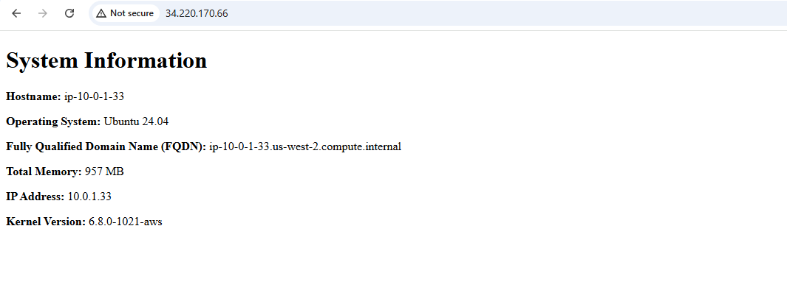

# A01331949 Tristan Torres Lab 7 
Create a new SSH Key pair
```
ssh-keygen -t ed25519 -f ~/.ssh/aws 
```

Validating playbook.yml
```
ansible-playbook --syntax-check playbook.yml
```

Using ansible-lint
```
ansible-lint playbook.yml
```

## Summary of steps and commands used:
- Running the provided starter script: ```./import_lab_key ~/.ssh/aws.pub```
- Creating a terrafrom project: ```terraform init```
- Applying terraform based on given main.tf: ``` terraform apply ```
- Adding the public IPs of both servers: ``` vim ../ansible/inventory/hosts.yml ```
- Editing playbook.yml: ``` vim playbook.yml ```
- Testing yaml syntax: ``` ansible-playbook --syntax-check playbook.yml ```
- Testing playbook.yml using lint : ``` ansible-lint playbook.yml ```
- Executing based on updated playbook.yml:  ```ansible-playbook playbook.yml```

## Server 1: Hosting the HTML template

